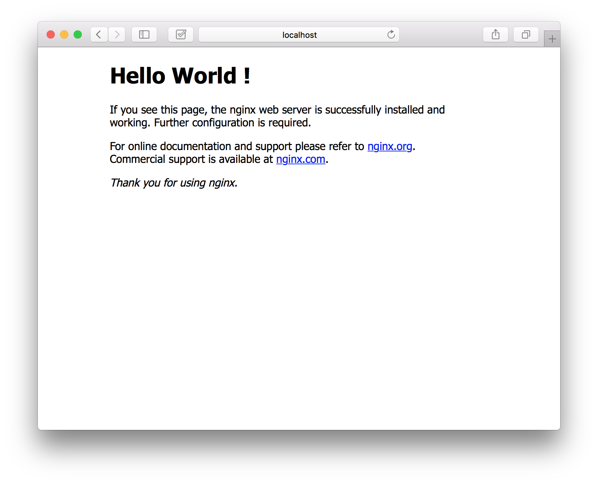

## Demo12 : 打造一個簡易網站
你已經學會了 Docker 的基本指令用法，現在我們開始一步一步實作出一個簡易的網站。在這裡我們要教你如何使用已學會的方法，實作出一個簡易的網站，並且透過瀏覽器檢視結果。

## 前置
無

## 實作
首先，我們先將 Nginx 映像檔(Image)下載至本機上。

```
$ docker pull nginx
```

> 再次提醒，假如沒有給予映像檔版本，預設系統下載版本為 latest。

接下來，我們使用啟動容器(Container)的指令，將我們下載的映像檔啟動。

```
$ docker run -tid -p 81:80 nginx
```

> 注意，這裡會帶入一個 -p 參數，表示我們要將本機的 port 與容器內的 port 作串接，格式為 -p <本機 port> : <容器 port>。

當以上步驟完成以後，你可以列出現在正在執行的容器，檢視 Nginx 容器是否正在執行中。

```
$ docker ps
```

> 此時，打開你的瀏覽器並且輸入 `http://localhost:81` 應該可以看到 Nginx 的預設歡迎介面。

接著，我們嘗試修改網站的訊息，先進入 Nginx 容器內。

```
$ docker exec -ti 6a9c5e18fe93 bash
```

> 注意，這裡的容器 ID 並非固定的，使用者必須依照自己所建立的容器自行修改對應的值。

最後，我們進入 `/usr/share/nginx/html/index.html` 檔案中，並且將 `<h1>Welcome to nginx!</h1>` 修改成 `<h1>Hello World !</h1>`。

```
$ vim /usr/share/nginx/html/index.html
```

> 注意，預設容器內沒有安裝 `vim` ，你必須透過 `apt-get update & apt-get install -y vim` 進行安裝。
> 使用 `vim` 編輯軟體編輯時，必須點擊 `i` 進入編輯模式，若修改完成後點擊 `esc` 並且輸入 `:wq` 進行儲存與離開。


## 結果

完成結果如下。

