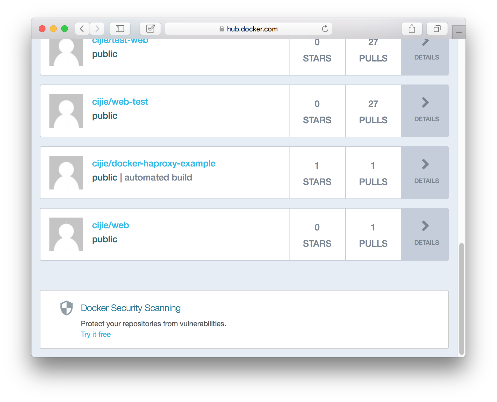

## Demo14 : 映像檔上傳
打包完以後，將映像檔(Image)上傳至 Docker Hub 提供其他使用者使用吧！在這裡我們教你如何將已打包完成的映像檔上傳至 Docker Hub。

## 前置
擁有一個現成或打包完成的映像檔。

## 實作
我們使用下列指令，將我們已打包完成的映像檔，上傳至 Docker Hub。

```
$ docker push cijie/web:1.0.0
```

> 注意，使用這個指令必須在已登入狀態，並且需先確認這個映像檔是否存在。
> 指令格式如： docker push 使用者名稱/映像檔名稱:版本

## 結果

最後，可以至 Docker Hub 上檢視你上傳的映像檔。


