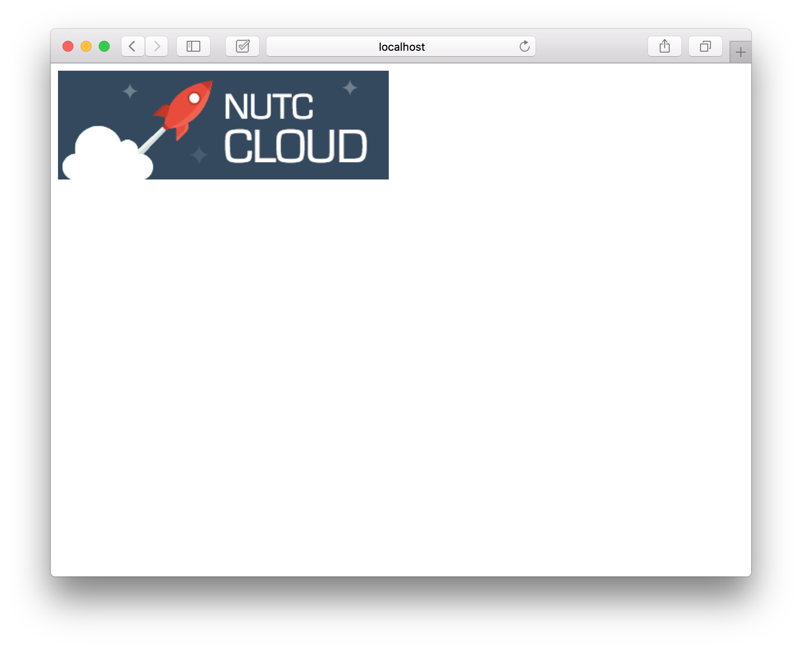

## Demo15 : Dockerfile
到目前為止，你會發現假如我們需要一個應用服務，勢必都需由使用者手動一行一行指令安裝相依套件，是否有方法可以提供我們更快的方式建置好我們需要的應用服務呢？答案是有的，我們可以先寫好一個 Dockerfile 再去執行這個檔案即可，概念你可以把它想像成我們已經寫好一份腳本，內容包含我們要安裝的套件與修改的檔案等等，系統會根據腳本撰寫的內容將你的需求逐步建置完成，最後輸出成一個映像檔(Image)。在這裡我們要教你如何建立一個符合自己需求的 Dockerfile。

## 前置
無

## 實作
首先，我們開啟 Dockerfile 檔案並檢視內容。

```
From nginx
MAINTAINER "James Lee <cjlee8110@gmail.com>"

USER root

RUN apt-get update && \
    apt-get install -y vim

WORKDIR /usr/share/nginx/html

COPY ./index.html ./
COPY ./images/NUTC_cloud.png ./images/NUTC_cloud.png
```

> * From : 使用的基底映像檔。
> * MAINTAINER : 設計這個 Dockerfile 的開發者資訊，提供後續聯繫使用。
> * USER : 使用者權限。
> * RUN : 在容器內想要執行的指令，包含建立檔案、安裝相依套件...等等。
> * WORKDIR : 變更工作目錄，再此行後面的指令皆位於新目錄下使用。
> * COPY : 由本機複製檔案至容器內部。

我們了解 Dockerfile 內所撰寫的內容後，接著我們開始讓系統依照我們的需求將映像檔建置出來。

```
$ docker build .
```

> 注意，最後面的 . 表示執行目前目錄下的 Dockerfile，也可以透過輸入目錄執行其他目錄下的 Dockerfile。

完成後，你會在映像檔列表中發現一個名為 `null` 的映像檔。

```
REPOSITORY          TAG                 IMAGE ID            CREATED             SIZE
<none>              <none>              24a2d4fe8529        13 minutes ago      220.2 MB
```

最後，使用這個映像檔啟動對應的容器服務即可。

```
$ docker run -tid -p 8080:80 24a2d4fe8529
```

## 結果

最後，你可以打開瀏覽器，輸入相對應的 IP 與 port 觀看結果。


